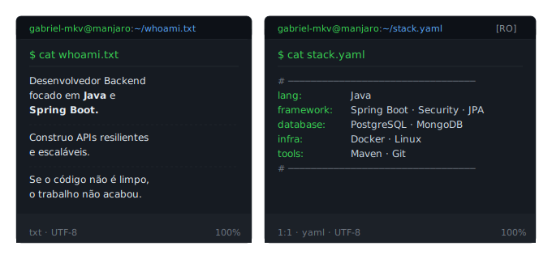

# gabriel-mkv / README.md

<div align="center">


</div>



```bash
$ cat metrics.base.svg
```

<div align="center">
  
</div>

```bash
$ git log --contributions
```

<picture>
  <source media="(prefers-color-scheme: dark)" srcset="https://raw.githubusercontent.com/gabriel-mkv/gabriel-mkv/output/github-contribution-grid-snake-dark.svg">
  <source media="(prefers-color-scheme: light)" srcset="https://raw.githubusercontent.com/gabriel-mkv/gabriel-mkv/output/github-contribution-grid-snake.svg">
  
</picture>

&nbsp;

```
$ ls -la contact/
```
&nbsp;

<table align="center">
  <tr>
    <th>PERMISSIONS</th>
    <th>PLATFORM</th>
    <th>USERNAME</th>
    <th>STATUS</th>
    <th>LINK</th>
  </tr>
  <tr>
    <td><code>-rw-r--r--</code></td>
    <td>LinkedIn</td>
    <td>gabrielmkv</td>
    <td>🟢 online</td>
    <td><a href="https://www.linkedin.com/in/gabrielmkv"></a></td>
  </tr>
  <tr>
    <td><code>-rw-r--r--</code></td>
    <td>GitHub</td>
    <td>gabriel-mkv</td>
    <td>🟢 online</td>
    <td><a href="https://github.com/gabriel-mkv"></a></td>
  </tr>
</table>
